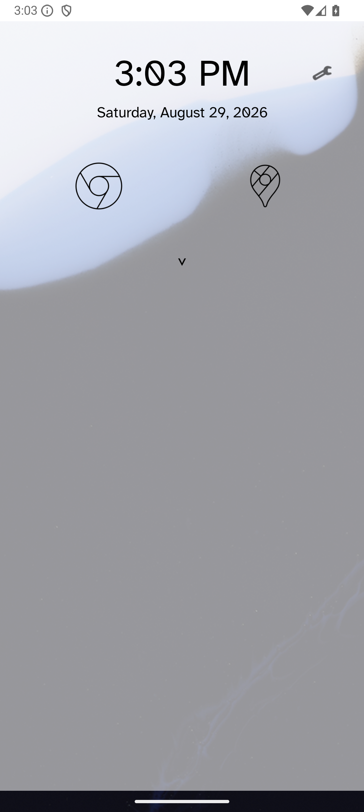
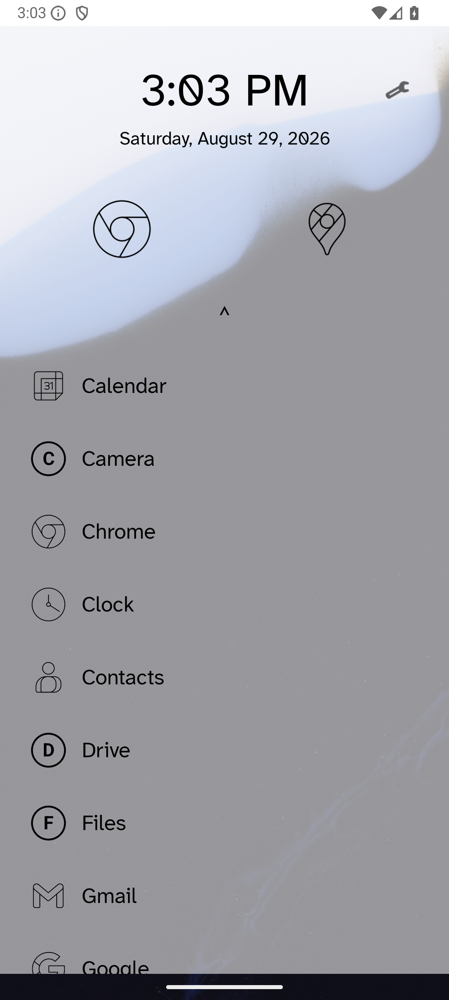
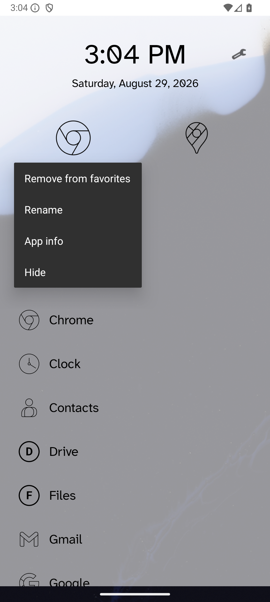
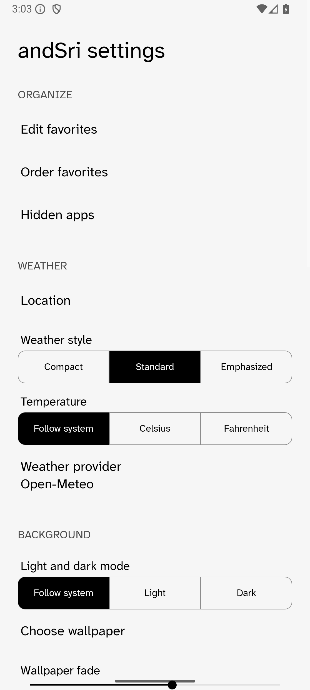
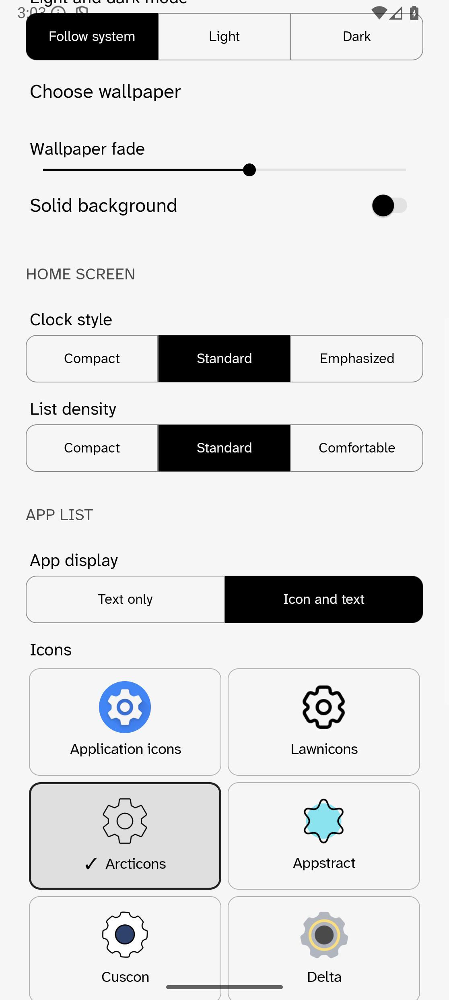

# andSri

A quiet, highly efficient Android launcher with one scrolling home screen, deliberate customization, and no attention-seeking clutter.

## Screenshots

<p align="center">
  
  
  
  
  
</p>

## Download

**[Download the latest signed APK](https://github.com/Shape-Machine/andsri-launcher-public/releases/latest/download/andSri.apk)** · [Release notes](https://github.com/Shape-Machine/andsri-launcher-public/releases/latest) · [SHA-256 checksums](https://github.com/Shape-Machine/andsri-launcher-public/releases/latest/download/SHA256SUMS)

Android may ask your browser or file manager for permission to install the APK. Official releases use certificate SHA-256 `05eab865f1f91c995c59677ff09f777e854e84e9c2ee9e16d868972f052680ea`, so future updates install without clearing launcher settings.

## Principles

- **Quiet by default:** no search box, suggestions, badges, feeds, widgets, or unnecessary motion.
- **Efficient by design:** no telemetry, analytics, polling, background services, scheduled work, or idle networking.
- **Direct and predictable:** favorites and every visible app live on one vertically scrolling screen.
- **Private and intentional:** weather connects only after a location search or refresh tap; hidden apps require device authentication.
- **Small, durable technology:** Kotlin, classic Android Views, platform APIs, and no production runtime dependencies.

## Benefits

- Spend less time navigating and more time opening the app you intended.
- Keep idle battery, CPU, memory, and network use exceptionally low.
- Personalize icons, typography, density, wallpaper, and light/dark appearance without turning Home into a control panel.
- Keep favorite apps close while retaining a complete alphabetical list.
- Use English, Dutch, or Hindi with Android-managed backup of lightweight configuration.

## Build

Requires Android SDK 36 and Java 21.

```sh
./gradlew testDebugUnitTest lintDebug assembleDebug
```

The public repository contains no signing key. Debug builds cannot update an official installation without uninstalling it first.

## Licensing

No license has yet been granted for andSri's original source code. Third-party fonts and icons retain their respective licenses; see [third_party](third_party/README.md).
