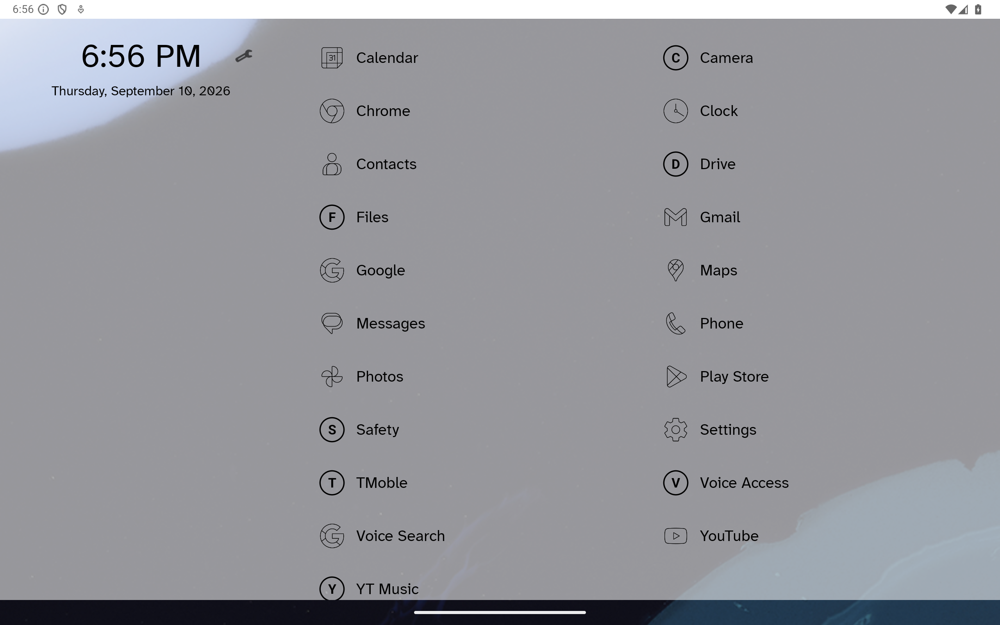
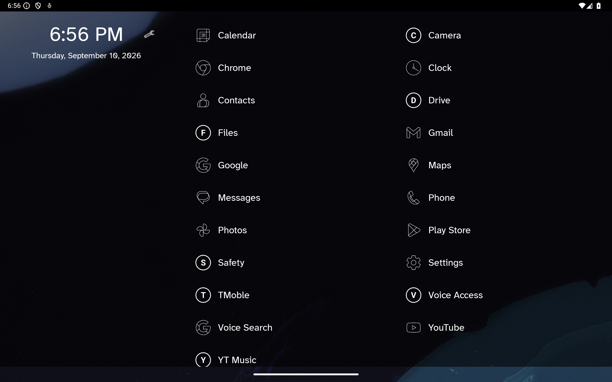
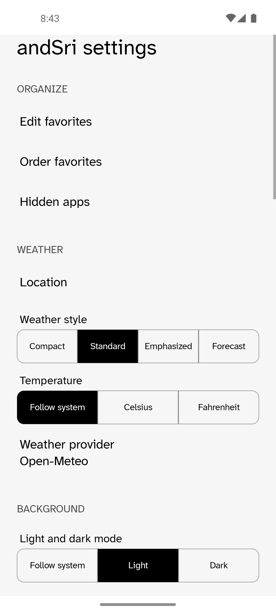
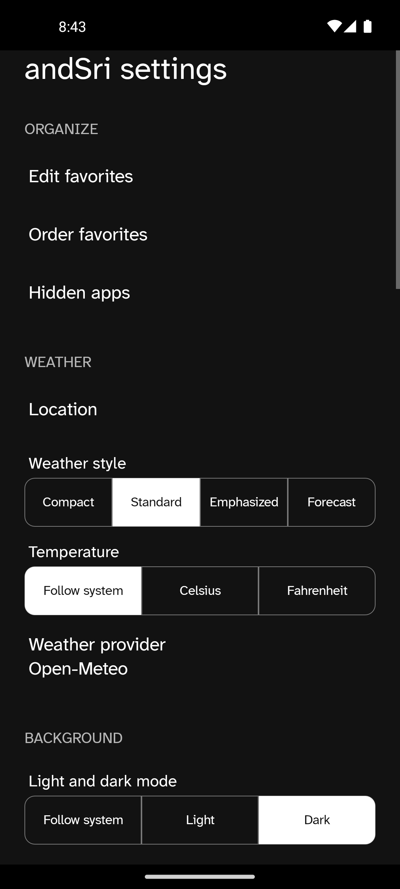

# andSri

Minimal Android launcher. One scrolling screen. No clutter. Android 13+.

## Screenshots

| Screen | Light | Dark |
|---|---|---|
| Tablet landscape |  |  |
| Home, weather, next alarm |  |  |
| Home, weather, 8 favorites |  |  |
| Newsreader serif home |  |  |
| All apps |  |  |
| App actions |  |  |
| Settings |  |  |

Weather data shown is representative.

## Download

**[Download the latest signed APK](https://github.com/Shape-Machine/andsri-launcher-public/releases/latest/download/andSri.apk)** · [Release notes](https://github.com/Shape-Machine/andsri-launcher-public/releases/latest) · [SHA-256 checksums](https://github.com/Shape-Machine/andsri-launcher-public/releases/latest/download/SHA256SUMS)

Latest release: **0.8.11**. Unified settings controls and YouTube icons in every bundled pack.

Requires Android 13+. Android may request permission to install the APK. Release certificate SHA-256: `05eab865f1f91c995c59677ff09f777e854e84e9c2ee9e16d868972f052680ea`. Signed updates preserve settings.

## Principles

- **Focus:** no search, suggestions, badges, feeds, widgets, or custom animation.
- **Efficiency:** no telemetry, analytics, polling, background services, scheduled work, or idle networking.
- **Predictability:** one responsive APK uses a focused phone layout or a two-region tablet layout.
- **Privacy:** current and 12-hour forecast weather is user-triggered; hidden apps require device authentication.
- **Durability:** Kotlin, classic Android Views, platform APIs, zero production runtime dependencies.

## Benefits

- Fewer steps from Home to app.
- Exceptionally low idle battery, CPU, memory, and network use.
- Configurable icons, typography, density, wallpaper, appearance, and efficient cached weather forecasts.
- Fast favorites plus a complete alphabetical list, including an efficient two-column tablet view.
- English, Dutch, and Hindi; Android-managed configuration backup.

## Build

Requires Android SDK 36 and Java 21.

```sh
./gradlew testDebugUnitTest lintDebug assembleDebug
```

No signing key is included. Debug builds require uninstalling an official installation first.

## Licensing

andSri is source-available. Use, modify, and redistribute it free of charge. Monetization is prohibited. Distributed forks must remain free and publish their source under the same terms. See [LICENSE](LICENSE).

Third-party fonts and icons retain their licenses: [third_party](third_party/README.md).
